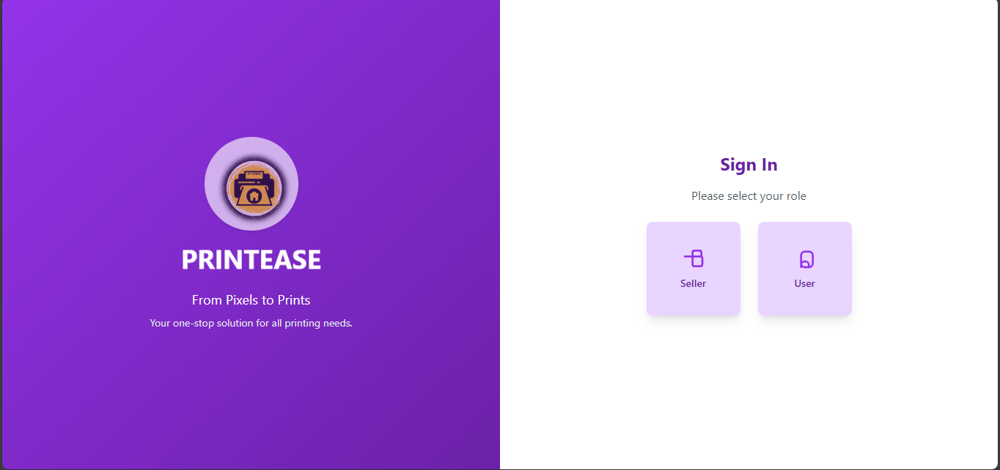

# PrintEase

PrintEase is an online platform that connects buyers and sellers of printing services. The platform allows buyers to order print jobs from various shops and sellers to manage their shops and process orders from buyers. The flow of the website is designed to be user-friendly, offering distinct paths for buyers and sellers.

## Flow of Website

### 1. Home Page
When users arrive at the website, they are presented with options to log in as either a **Buyer** or a **Seller**.

### 2. User Sign Up/Login
- **Buyers:** After logging in, buyers are presented with a list of available shops to choose from. 
- **Sellers:** Sellers can sign up by providing their details and register their shop on the platform.

### 3. Seller Sign Up/Login
- Sellers can create an account and register their shop.
- Once logged in, sellers can view the orders placed by buyers, and manage the operations of their shop.

### 4. Buyer Dashboard
Once a buyer logs in, they are redirected to their dashboard, where they can select a shop from the list and browse the available services.

### 5. Place Order Page
- Buyers can upload their document to print, and proceed with the order.
- They will be guided through a seamless process of selecting print specifications, reviewing the document, and confirming the order.

### 6. Payment Integration
The buyer is then redirected to a secure payment gateway to complete the payment for the order.

### 7. Order Confirmation
Once the payment is successful, the buyer receives an order confirmation, and the order is processed.

### 8. Seller Dashboard
Once the order is confirmed, the seller is notified and can view the order details along with the buyer's information to process the print job.

## Technologies Used

- **Frontend:** React.js, TailwindCSS
- **Backend:** Node.js, Express.js
- **Payment Gateway** : Integrate PhonePe using reactjs and nodejs
- **Database:** MongoDB

## Features

- **Buyer Dashboard:** Allows buyers to choose from various shops, place orders, and track their orders.
- **Seller Dashboard:** Allows sellers to manage their shop, view orders, and manage their business.
- **User Authentication:** Secure login and sign-up for both buyers and sellers.
- **Payment Gateway Integration:** Seamless integration with payment providers to handle transactions.
- **Responsive Design:** The platform is optimized for use across devices including desktops, tablets, and mobile phones.

